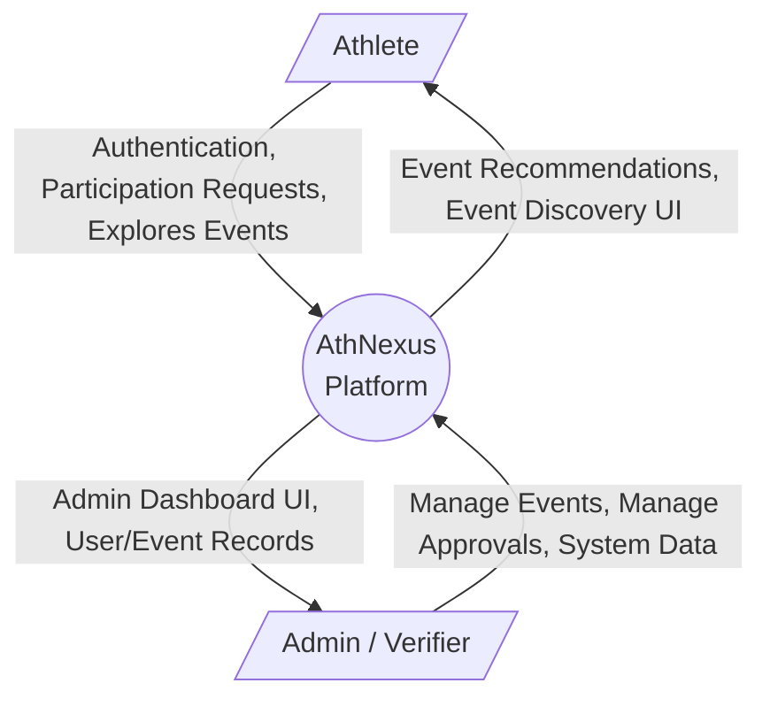
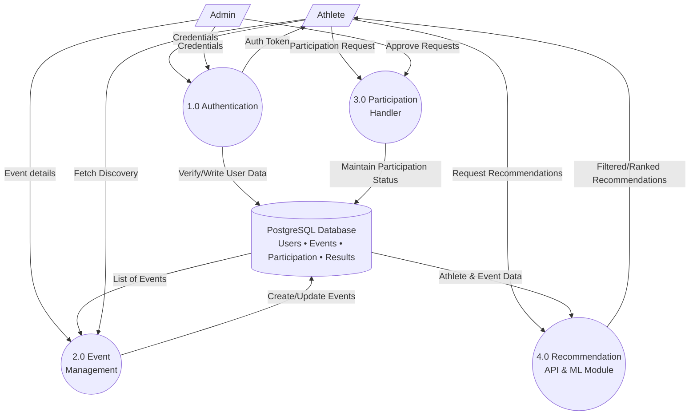
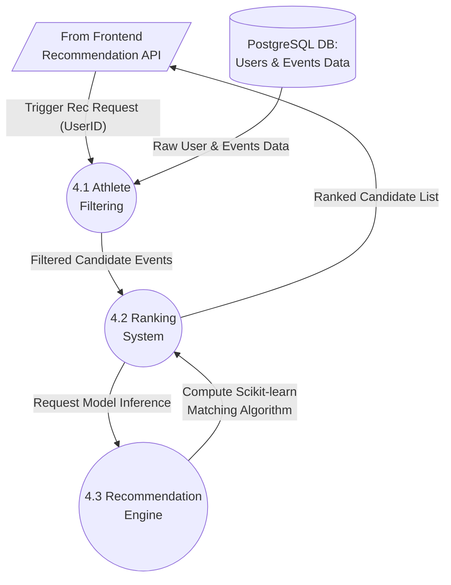

# AthNexus DFDs (Data Flow Diagrams)

This document contains the Data Flow Diagrams defining the flow of information across the AthNexus platform, directly aligned with the official system architecture (React, Flask/FastAPI, Python/Scikit-learn, PostgreSQL).

## 1. Context Diagram (Level 0)
The Context Diagram provides the highest-level view of the entire system.

---

## 2. Level 1 DFD (Major Modules & Processes)
The Level 1 diagram breaks the AthNexus platform down into its primary backend modules as outlined in the architecture diagram.

---

## 3. Level 2 DFD (Focus: ML & Recommendations Subsystem 4.0)
The Level 2 diagram breaks down Process 4.0 into the specific Machine Learning components from the diagram.

