# AthNexus Platform: System Architecture

Based on the provided architecture diagram image, here is the official system architecture recreation using Mermaid.

```mermaid
flowchart LR
    %% Entities
    Athlete([User<br>Athlete])
    Admin([Admin])

    %% Components
    subgraph Frontend ["Frontend (React TSX)"]
        direction TB
        Home[Home]
        EventDisc[Event Discovery]
        Recs[Recommendations]
        PartReq[Participation Request]
    end

    subgraph Backend ["Backend (Flask / FastAPI)"]
        direction TB
        Auth[Authentication]
        EventMgmt[Event Management]
        PartHand[Participation Handler]
        RecAPI[Recommendation API]
    end

    subgraph ML ["ML Module (Python + Scikit-learn)"]
        direction TB
        AthFilter[Athlete Filtering]
        RankSys[Ranking System]
        RecEng[Recommendation Engine]
    end

    subgraph DB ["PostgreSQL Database"]
        direction LR
        DBData[(Users • Events • Participation • Results)]
    end

    %% Flows
    Athlete --> Frontend
    Admin --> Frontend
    
    Frontend -.->|API Requests| Backend
    Backend -.->|Model Pipeline| ML
    
    Backend -.->|Read / Write| DB
    ML -.->|Read Data| DB
```

## System Architecture Overview
This diagram illustrates the system architecture of the AthNexus platform. 
* The **Frontend (React)** allows users to explore sports events, request participation, and view recommendations. 
* The **Backend (Flask/FastAPI)** handles API requests, business logic, and communication with the PostgreSQL database. 
* The **Machine Learning module (Scikit-learn)** processes athlete data and generates personalized event recommendations. 
* **Admin** users manage events, approvals, and system data through a secure dashboard.
